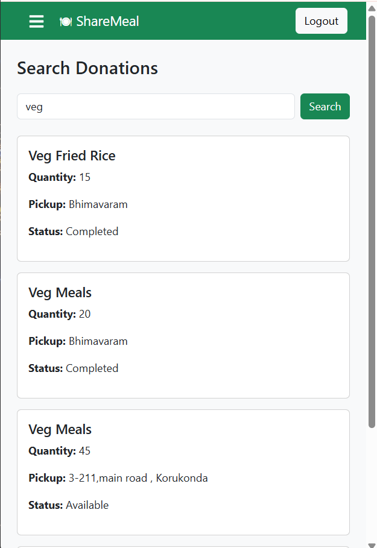

## 📸 Screenshots

### 🔐 Login Page

The login page allows registered users to securely access the system using their email and password. JWT authentication is used to validate users based on their roles.

---

### 📝 Register Page

New users can create an account by providing their details and selecting either the Restaurant or NGO role. The information is securely stored in MongoDB Atlas.

---

### 🍽️ Restaurant Dashboard

The Restaurant Dashboard provides an overview of donation statistics, quick navigation, and allows restaurants to efficiently manage their food donations.

---

### 🏢 NGO Dashboard

The NGO Dashboard displays available donations, claimed donations, and completed donations, enabling NGOs to manage food collection effectively.

---

### ➕ Add Donation

Restaurants can create a new food donation by entering details such as food name, quantity, pickup location, and expiry time. The donation becomes available for NGOs to claim.

---

### 📋 My Donations

This page displays all donations created by the logged-in restaurant. Restaurants can edit or delete donations before they are claimed.

---

### 🔍 Search Donations

NGOs can search for available food donations using keywords, making it easier to find suitable donations quickly.

---

### 👤 Profile Page

The profile page displays the logged-in user's information and allows them to view their account details based on their selected role.

---

### ✅ Completed Donations

This page shows the history of successfully completed food donations, helping users track completed donation activities.

